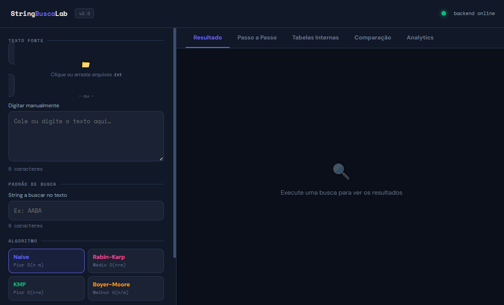
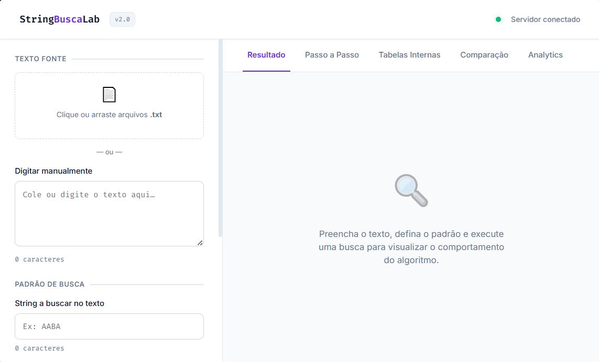

<div align="center">

# Relatório de Alterações e Utilização de IA

### Comparação de Algoritmos de Busca em Strings

**Algoritmos Avançados — Católica SC**

<p>
  
  
  
  
</p>

</div>

---
<div align="center">
O projeto foi evoluído para uma arquitetura cliente-servidor funcional, instrumentada com OpenTelemetry e com um frontend completamente redesenhado.


### 🧭 Sumário

[Problema Central Corrigido](#1-problema-central-corrigido) • [Arquitetura Final](#2-arquitetura-final) • [Alterações por Arquivo](#3-alterações-por-arquivo-utilizando-ia) • [Melhorias de Front-end](#31-melhorias-no-front-end-entregue-pela-ia) • [Fluxo de Requisição](#4-fluxo-de-uma-requisição-com-observabilidade) • [Como Executar](#5-como-executar)

</div>

---

## 1. Problema Central Corrigido

### 🐛 Bug crítico: desconexão frontend ↔ backend

O `index.html` original implementava todos os algoritmos diretamente em JavaScript e **nunca chamava o backend Flask**.

> **Solução:** o frontend foi reescrito para consumir exclusivamente a API REST via `fetch()`. Toda lógica de algoritmo reside no Python. O HTML é apenas interface.

---

## 2. Arquitetura Final

```
string_busca_lab/
├── algoritmos.py       # Padrão Strategy — 4 algoritmos
├── observabilidade.py  # OpenTelemetry: traces, métricas, logs  ← NOVO
├── controlador.py      # Camada de negócio + instrumentação
├── servidor.py         # Flask + CORS + middleware de trace
├── index.html          # Frontend redesenhado com fetch() real
├── testes.py           # Suite 60/60
└── requirements.txt    # Dependências declaradas             ← NOVO
```

---

## 3. Alterações por Arquivo Utilizando IA

**Uso de IA:** para a atualização e correções no código foi utilizado o **Claude Code**, um agente de programação inteligente da Anthropic que funciona diretamente no terminal do computador. Ele atua como um assistente autônomo que lê o projeto, edita arquivos, roda testes e corrige bugs com base em comandos simples.

Baseadas em experiências anteriores utilizando a ferramenta, utilizamos um prompt extenso e detalhado, visando caracterizar todas as necessidades de mudança no projeto geral. Dessa forma, a IA primeiramente analisa o projeto completo fazendo um diagnóstico e depois corrige e faz alterações conforme especificado no comando do prompt.

<details>
<summary><b>💬 Prompt utilizado (clique para expandir)</b></summary>
<br>

*"Você é um desenvolvedor de software, o projeto em anexo tem erro de conexão do backend em Python com o frontend em HTML. Preciso que corrija esse erro com boas práticas e refatoração no código."*

*Deve ser realizado também o descritivo abaixo:*

*Evoluir a aplicação existente, incorporando:*
- Práticas de engenharia de software
- Uso de padrões de projeto
- Implementação de observabilidade
- Instrumentação com OpenTelemetry

*Foco principal em:*
- Qualidade de código
- Organização e arquitetura
- Monitoramento e análise da execução da aplicação
- Boas práticas de desenvolvimento
- Aplicação do padrão Strategy
- Separação de responsabilidades
- Código organizado e reutilizável
- Estrutura clara de retorno (SearchResult)
- Observabilidade (principal foco) com instrumentação em OpenTelemetry
- Implementação de traces, métricas e logs
- Melhora no frontend focando em visualização de tempo de execução por algoritmo, número de execuções e comparações entre algoritmos
- Análise com dados reais, execução com arquivos grandes e comparação entre comportamento teórico e prático

*"Você deve me retornar o projeto atualizado e um relatório das alterações realizadas."*

</details>

### Alterações realizadas com o auxílio da IA

#### 📄 `algoritmos.py`

| O que mudou | Detalhe |
|---|---|
| Alias `BuscaIngenua = BuscaNaive` | Mantém compatibilidade com `testes.py` legado sem duplicar código |
| Docstrings completos | Complexidade, comportamento e casos extremos documentados |
| Helper `_montar_resultado` na classe base | Elimina duplicação de código nas 4 implementações |
| Tipagem com `from __future__ import annotations` | Compatibilidade Python 3.9+ sem quebrar hints |

#### 🆕 `observabilidade.py` — *arquivo novo*

Responsável por toda a instrumentação OpenTelemetry:

- **Traces:** `TracerProvider` com `BatchSpanProcessor` + `ConsoleSpanExporter`. Cada requisição HTTP e cada chamada de algoritmo gera um span rastreável com atributos (`algoritmo`, `tempo_ms`, `comparacoes`, `ocorrencias`).
- **Métricas:** `MeterProvider` com `PeriodicExportingMetricReader` (exporta a cada 30 s). Instrumentos criados:
  - `busca.execucoes.total` — Counter de execuções por algoritmo
  - `busca.tempo_execucao` — Histogram de tempo em ms
  - `busca.comparacoes` — Histogram de comparações
  - `busca.tamanho_texto` — Histogram de tamanho do input
  - `busca.ocorrencias` — Histogram de ocorrências encontradas
- **Logs:** logger estruturado com `logging.Filter` que injeta o `trace_id` atual em cada linha, correlacionando log ↔ trace automaticamente.
- **Resource:** identifica o serviço (`service.name`, `service.version`, `deployment.environment`) em todos os sinais.

#### ⚙️ `controlador.py`

| O que mudou | Detalhe |
|---|---|
| Spans em cada operação | `executar_busca`, `executar_todos`, `obter_analytics` abrem spans com atributos relevantes |
| Registro de erro com `span.record_exception` | Exceções são capturadas no trace além do log |
| `_registrar_historico()` | Mantém os últimos 200 resultados por algoritmo em memória para Analytics |
| `obter_analytics()` — *novo* | Agrega mín/média/máx de tempo e comparações + sparkline dos últimos 50 |
| Tratamento de exceção explícito | `try/except` com log estruturado; retorna JSON de erro sem quebrar o servidor |

#### 🌐 `servidor.py`

| O que mudou | Detalhe |
|---|---|
| `flask-cors` | Elimina erros de CORS ao abrir o HTML de outra origem |
| Middleware `before_request` / `after_request` | Abre e fecha span raiz por requisição com `http.method`, `http.url`, `http.status_code` |
| `GET /api/analytics` — *novo* | Endpoint para o painel de Analytics do frontend |
| Validação de payload | `get_json(force=True, silent=True)` + verificação de tipos; retorna HTTP 400 com mensagem clara |
| Handlers `404` e `500` | Erros globais retornam JSON estruturado e emitem log |
| `request.get_json` substituindo `request.json` | Evita `NoneType` quando Content-Type está ausente |

#### 🖥️ `index.html` — *reescrito*

**Antes:** executava algoritmos em JS, sem qualquer chamada HTTP ao backend.
**Depois:** interface completamente redesenhada que só consome a API Flask.

**Conexão real com backend:**

```javascript
// Antes — executava tudo em JS local, sem fetch
function buscaNaive(texto, padrao) { /* implementação JS */ }

// Depois — chama o backend Python
const data = await apiPost('/api/buscar', { texto, padrao, algoritmo: algoSel });
```

**Novas funcionalidades do frontend:**

| Funcionalidade | Descrição |
|---|---|
| Indicador de status | Bolinha verde/vermelha que verifica `/api/algoritmos` a cada 10 s |
| Upload de arquivo `.txt` | Drag & drop ou clique — carrega arquivos reais para benchmark |
| Contador de caracteres | Mostra tamanho do texto e do padrão em tempo real |
| Aba Resultado | Métricas, posições destacadas e visualizador do texto com matches coloridos |
| Aba Passo a Passo | Slider + botão Auto com 150 ms/passo — mostra cada comparação com destaque em tempo real |
| Aba Tabelas Internas | Tabela LPS (KMP), Mau Caractere (Boyer-Moore) e Hashes por Janela (Rabin-Karp) com explicações |
| Aba Comparação | Barras animadas de tempo e comparações + tabela comparativa + guia "quando usar cada algoritmo" |
| Aba Analytics | Dados acumulados de todas as execuções: mín/média/máx de tempo e comparações + sparkline histórico |

#### ✅ `testes.py`

| O que mudou | Detalhe |
|---|---|
| Import corrigido | `BuscaIngenua` importada corretamente (alias em `algoritmos.py`) |
| `from __future__ import annotations` | Tipagem consistente com o restante do projeto |
| 60/60 passando | Todos os 12 casos × 5 instâncias (incluindo o alias) passam |

---

## 3.1 Melhorias no front-end entregue pela IA

O layout de front-end entregue pela IA do Claude Code passou em todos os testes de conexão e possuía todas as funcionalidades de dashboard necessárias. Porém, seu design não seguia os padrões de qualidade — por exemplo: tipografia pouco profissional (fonte muito pequena e pouco legível), hierarquia de tamanho de fonte (whitespace) inconsistente e cores do sistema muito sólidas e escuras.

<div align="center">

<br/>
<sub><i>Figura 1 — Versão inicial gerada pelo Claude Code</i></sub>
</div>

<br>

**Utilização de outra IA:** pensando nas melhorias a serem realizadas no layout, optamos por utilizar a IA do Google (**Gemini**), por ser mais experiente e profissional no âmbito de design.

<details>
<summary><b>💬 Prompt utilizado (clique para expandir)</b></summary>
<br>

*"Finja ser desenvolvedor frontend com conhecimentos de UX design e deixe o layout mais clean, mude a letra para algo mais profissional e legível e as cores para tons mais 'dia'."*

</details>

**Resposta obtida — aplicação de premissas clássicas de UX/UI, mantendo toda a lógica do JavaScript e IDs intactos:**

| Melhoria | Descrição |
|---|---|
| 🔤 **Tipografia Profissional** | Substituição das fontes anteriores por *Inter* (excelente legibilidade para interfaces) e *Fira Code* (padrão ouro para dados técnicos, métricas e visualização de código) |
| 📐 **Hierarquia e Respiro (Whitespace)** | Aumento do tamanho base da fonte para 15px e adição de mais preenchimento (padding) nos cards — informações passam a "respirar" |
| 🎨 **Bordas e Cores Suavizadas** | Redução no peso das bordas e substituição dos fundos escuros por tons de gelo e branco (inspirado nas paletas do Tailwind CSS e GitHub Light) |
| 🔘 **Botões Modernizados** | Adoção de um estilo flat com transições mais fluidas nos hovers, removendo o aspecto de "caixa rígida" |

<div align="center">

<br/>
<sub><i>Figura 2 — Versão refinada com auxílio do Gemini</i></sub>
</div>

---

## 4. Fluxo de uma Requisição com Observabilidade

```
Browser → POST /api/buscar
    │
    ├─ [TRACE] span: "POST /api/buscar"
    │     atributos: http.method, http.url
    │
    ├─ controlador.executar_busca()
    │     ├─ [TRACE] span: "executar_busca"
    │     │     atributos: algoritmo, tamanho_texto, tamanho_padrao
    │     │
    │     ├─ [TRACE] span: "algoritmo.kmp"
    │     │     → algoritmo executa aqui
    │     │
    │     ├─ [MÉTRICA] busca.execucoes.total +1  {algoritmo="kmp"}
    │     ├─ [MÉTRICA] busca.tempo_execucao histogram
    │     ├─ [MÉTRICA] busca.comparacoes histogram
    │     │
    │     └─ [LOG] "busca_concluida | {algoritmo, tempo_ms, ocorrencias}"
    │               (com trace_id injetado no prefixo)
    │
    └─ [TRACE] span fechado com http.status_code=200
```

---

## 5. Como Executar

```bash
# 1. Instalar dependências
pip install -r requirements.txt

# 2. Rodar os testes
python testes.py

# 3. Iniciar o servidor
python servidor.py

# 4. Abrir no navegador
# http://127.0.0.1:5000
```

<div align="center">

---

Relatório elaborado para a disciplina de Algoritmos Avançados — Católica SC

</div>
